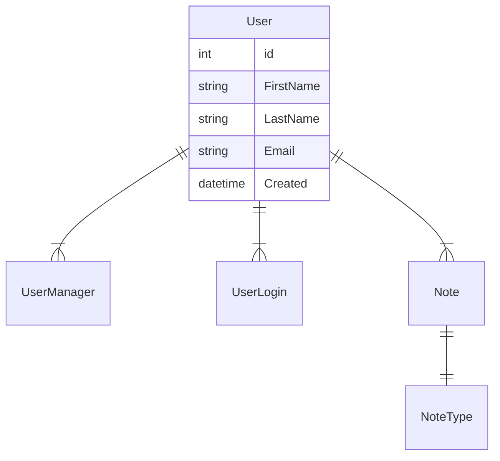
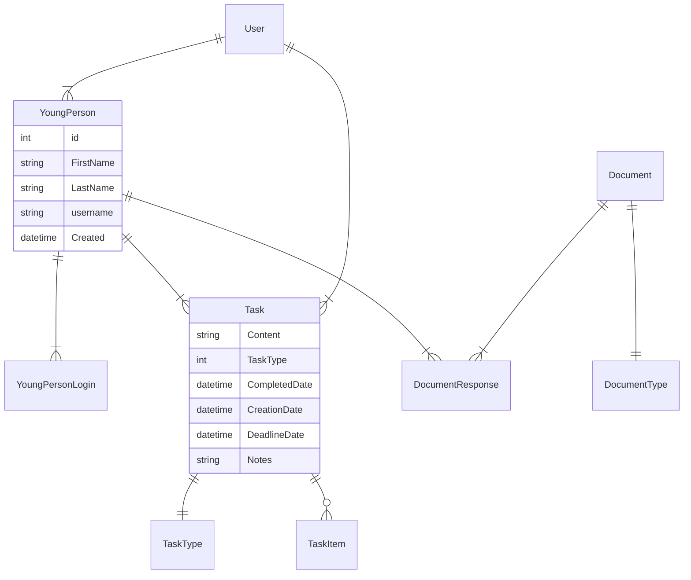

## User

```mermaid
 erDiagram
 User ||--|{ UserManager: ""
 
 User {
   int id
   string FirstName
   string LastName
   string Email
   datetime Created
 }
 User ||--|{ UserLogin: ""
 User ||--|{ Note: ""
 Note ||--|| NoteType: ""
```

## Young Person

```mermaid
 erDiagram
 User ||--|{ YoungPerson: ""
 YoungPerson ||--|{ YoungPersonLogin: ""
 YoungPerson {
   int id
   string FirstName
   string LastName
   string username
   datetime Created
 }
 YoungPerson ||--|{ Task: ""
 User ||--|{ Task: ""
 Task ||--|| TaskType: ""
 Task ||--o{ TaskItem: ""
 Task {
   string Content
   int TaskType
   datetime CompletedDate
   datetime CreationDate
   datetime DeadlineDate
   string Notes
 }
 YoungPerson ||--|{ DocumentResponse: ""
 Document ||--|{ DocumentResponse: ""
 Document ||--|| DocumentType: ""
```
